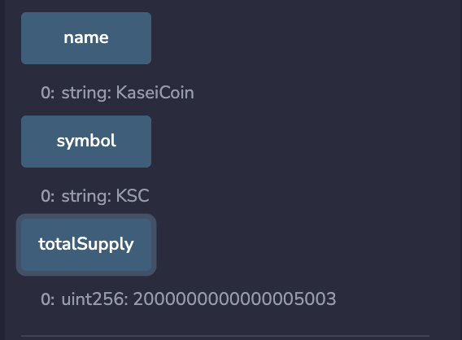

# Kasei Coin - UW FinTech BootCamp Module 21 Challenge

This project is my cryptocurrency KaseiCoin which is a ERC-20 compliant fungible token. I implement an automated crowdsale for tokens through Solidity smart contracts and deploy them on a [Ganache](https://trufflesuite.com/ganache/) personal blockchain that is integrated into a [Remix](https://remix.ethereum.org/) environment via [MetaMask](https://metamask.io/). 

---

## Summary

After successfully compiling the smart contracts using Remix, I deploy them by injecting my personal Ganache blockchain with the Metamask environment. 

The many functions that the contracts provide are then accessible through the Remix UI and supplied account addresses from Ganache are able to buy tokens that are automatically minted in the contracts. You are able to dynamically verify that a provided account address' balance has changed along with the total number of tokens minted and Ether wei raised. 

The following gifs demonstrate using two different addresses to buy KeseiCoin tokens:

**Account 1**

**Account 2**

---

## Evaluation Evidence

Videos of app usage can be found in the [Videos](./Resources/Videos/) folder, as well as in the [Gifs](./Resources/Gifs/) folder. 

Compiled contracts on Remix via Metamask and Ganache setup: 

**KaseiCoin**

**KaseiCoinCrowdsale**

**KaseiCoinCrowdsaleDeployer**

Verifying that the contracts keep track of the amount of wei that the minted tokens represent:

**balanceOf**

**weiRaised**

**totalSupply**

---

## Technologies

This is a Solidity project ran using the following dependencies:
1. [Solidity](https://soliditylang.org/) (^0.5.0) - Smart contract development
2. [Remix](https://remix.ethereum.org/) - Solidity development environment
3. [MetaMask](https://metamask.io/) - Connecting to injected Ethereum network 
4. [Ganache](https://trufflesuite.com/ganache/) - Personal blockchain environment

---

## Installation and Usage

If you would like to use these contracts yourself you can upload [KaseiCoin.sol](./KaseiCoin.sol) and [KaseiCoinCrowdSale.sol](./KaseiCoinCrowdsale.sol) to Remix and compile them using the 0.5.0+commit.1d4f565a and 0.5.5+commit.1d4f565a compilers, respectively. You will then have to connect your Ganache `HTTP://127.0.0.1:7545` blockchain to your Metamask test environment with the chain code of 1337. 

Then with the "Injected Provider - MetaMask" environment selected in Remix, you can deploy the `KaseiCoinCrowdsaleDeployer` contract with any of your Ganache accounts. With the kasei_crowdsale_address button in Remix you can then deploy the `KaseiCoinCrowdsale` contract, and the same can be done with kasei_token_address and `KaseiCoin`. 

You will then be able to use all of the functions as shown in the gifs shown in the [Summary](#summary) section. 

---

## Contributors

[Ethan Silvas](https://github.com/ethansilvas)

---

## License

This project uses the [GNU General Public License](https://choosealicense.com/licenses/gpl-3.0/)