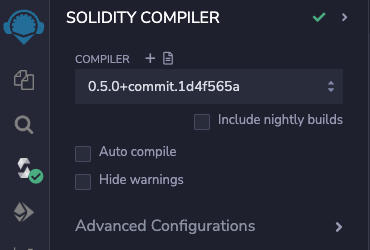
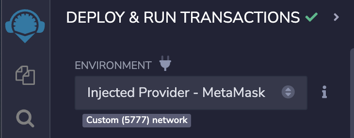

# Kasei Coin - UW FinTech BootCamp Module 21 Challenge

This project is my cryptocurrency KaseiCoin which is a ERC-20 compliant fungible token. I implement an automated crowdsale for tokens through Solidity smart contracts and deploy them on a [Ganache](https://trufflesuite.com/ganache/) personal blockchain that is integrated into a [Remix](https://remix.ethereum.org/) environment via [MetaMask](https://metamask.io/). 

---

## Summary

---

## Technologies

This is a Solidity project ran using the following dependencies:
1. [Solidity](https://soliditylang.org/) (^0.5.0) - Smart contract development
2. [Remix](https://remix.ethereum.org/) - Solidity development environment
3. [MetaMask](https://metamask.io/) - Connecting to injected Ethereum network 
4. [Ganache](https://trufflesuite.com/ganache/) - Personal blockchain environment

---

## Installation and Usage

---

## Contributors

[Ethan Silvas](https://github.com/ethansilvas)

---

## License

This project uses the [GNU General Public License](https://choosealicense.com/licenses/gpl-3.0/)