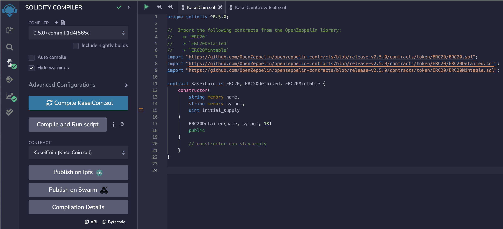

# Kasei Coin - UW FinTech BootCamp Module 21 Challenge

This project is my cryptocurrency KaseiCoin which is a ERC-20 compliant fungible token. I implement an automated crowdsale for tokens through Solidity smart contracts and deploy them on a [Ganache](https://trufflesuite.com/ganache/) personal blockchain that is integrated into a [Remix](https://remix.ethereum.org/) environment via [MetaMask](https://metamask.io/). 

---

## Summary

After successfully compiling the smart contracts using Remix, I deploy them by injecting my personal Ganache blockchain with the Metamask environment. 

The many functions that the contracts provide are then accessible through the Remix UI and supplied account addresses from Ganache are able to buy tokens that are automatically minted in the contracts. You are able to dynamically verify that a provided account address' balance has changed along with the total number of tokens minted and Ether wei raised. 

The following gifs demonstrate using two different addresses to buy KeseiCoin tokens:

**Account 1**

**Account 2**

---

## Evaluation Evidence

Videos of app usage can be found in the [Videos](./Resources/Videos/) folder, as well as in the [Gifs](./Resources/Gifs/) folder. 

Compiled contracts on Remix via Metamask and Ganache setup: 

**KaseiCoin**

**KaseiCoinCrowdsale**

**KaseiCoinCrowdsaleDeployer**

The contracts are designed so that they keep a running track of the amount of wei that the minted tokens represent. 

---

## Technologies

This is a Solidity project ran using the following dependencies:
1. [Solidity](https://soliditylang.org/) (^0.5.0) - Smart contract development
2. [Remix](https://remix.ethereum.org/) - Solidity development environment
3. [MetaMask](https://metamask.io/) - Connecting to injected Ethereum network 
4. [Ganache](https://trufflesuite.com/ganache/) - Personal blockchain environment

---

## Installation and Usage

---

## Contributors

[Ethan Silvas](https://github.com/ethansilvas)

---

## License

This project uses the [GNU General Public License](https://choosealicense.com/licenses/gpl-3.0/)